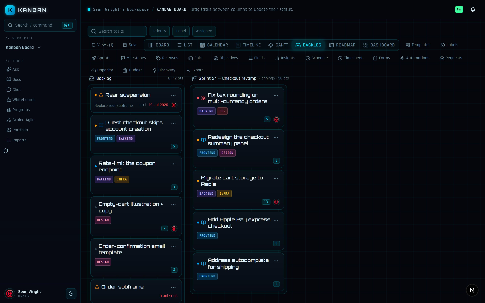
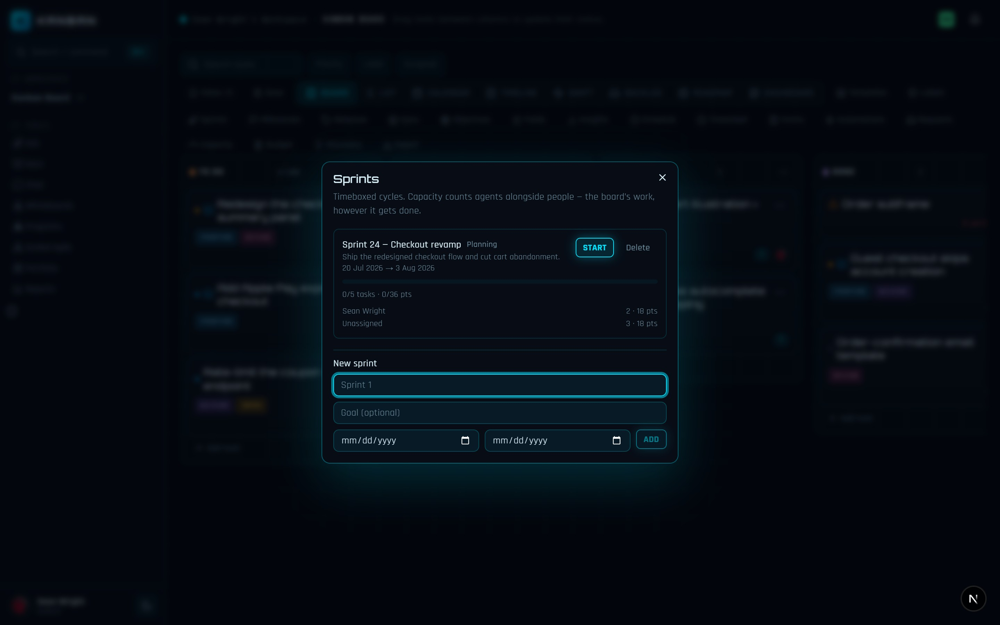

The board ships a full agile toolkit: a backlog lens for planning, sprints with velocity and burndown, WIP limits, releases that ship from git tags, a discovery pipeline with feedback intake, prioritization scoring, and a SAFe-style team layer. Everything here is board- or workspace-scoped and lives behind a labeled button — no setup beyond clicking it.

## Backlog

The backlog is every task with no sprint — a fourth lens on the same board, not a separate list. Switch to it with the `Backlog` toggle in the board toolbar (next to `Board`, `List`, `Calendar`; see [Planning views](/kanban/guide/planning-views/) for the rest).

The lens lays out one `Backlog` column plus a column for each planning or active sprint, each header showing its task count and total points. To plan:

1. Open the `Backlog` lens.
2. Drag a card from `Backlog` into a sprint column. This sets the task's sprint and nothing else — its board column (workflow state) is untouched.
3. Drag a card back to `Backlog` to unschedule it.

Cards sort by priority (highest first), then age. Completed sprints are not drop targets — their scope is frozen and the server refuses scheduling into them. Dragging requires the member role; viewers see the same lens read-only.



You can also assign a sprint per task: the task dialog's `Sprint` picker offers planning and active sprints (it appears once the board has at least one sprint).

## Sprints

Open the `Sprints` button in the board toolbar. The dialog lists every sprint with its status (`Planning`, `Active`, `Completed`), goal, date range, a points progress bar, and a per-assignee capacity breakdown that counts agents alongside people.



Create one under `New sprint` (member role):

1. Enter a name (for example `Sprint 1`), an optional goal, and optional start and end dates.
2. Click `Add`. The sprint starts in `Planning`.

Lifecycle:

| Status | Available action | What it does |
|---|---|---|
| Planning | `Start` | Makes the sprint active. |
| Active | `Complete` | Opens a rollover picker: `Move unfinished tasks to` the backlog or a planning sprint, then `Complete sprint`. |
| Completed | — | Scope is frozen; done points feed velocity. |

Each sprint row shows `done/total tasks · donePoints/points pts`, plus one capacity line per assignee (agents get a bot icon, unassigned work is called out). `Delete` asks `Really?` before removing a sprint.

## User stories and story points

Every task carries a `Type` (`Task`, `Bug`, `Story`) and an `Estimate` in points — both set in the task dialog, side by side, because sprint planning reads them together. `Story` is how you frame user-value work; the estimate is a non-negative integer, and leaving it blank means unestimated. Points roll up everywhere: sprint progress, backlog column headers, capacity rows, velocity, and burndown.

## Velocity and burndown

Both charts render in the `Insights` dialog (board toolbar), not in the Sprints dialog:

- **`Burndown — <sprint name>`** appears while a sprint with dates is active: remaining committed points at each day's end across the sprint window, replayed from the activity log, with an ideal line to compare against.
- **`Velocity — points completed per sprint`** charts completed points per *completed* sprint, oldest first, with the average marked. Completion reads each sprint's frozen done-scope, so later edits don't rewrite history.

More on Insights (throughput, cycle time, risks) in [Reporting](/kanban/guide/reporting/).

## WIP limits

Any column can carry a work-in-progress limit. From the column's `⋯` menu choose `Set WIP limit` (or `Change WIP limit`), type a number, and press Enter; empty the field to clear the limit. Member role, same as renaming a column.

The header then renders `4/3`-style counts, and going over the limit flags the count in the destructive style with an "Over the WIP limit" tooltip.

:::note
WIP limits are advisory. The board highlights an over-limit column but never blocks the drag — the limit is process tuning, not a hard gate.
:::

## Prioritization scoring

Each task can carry `Value` and `Risk` (both 0–10) beside its `Estimate` in the task dialog. The dialog shows a live `Score` readout as you type:

```
score = value / (estimate × (1 + risk / 10))
```

The score is derived on every read, never stored — change any input and it moves. It stays `—` until the task has both a value and a non-zero estimate; unset risk counts as no penalty. The `List` lens exposes the score as a sortable column, and CSV export includes it as `priority_score`.

## Releases

Open `Releases` in the board toolbar. A release is a version your work ships under — `planned` until it ships, then `released`. Member role for all writes.

1. Type a name under the input (for example `v1.2.0`) and click `Add`.
2. Click a release row to expand it, then use `Add a task…` to assign board tasks (or `Remove` to pull one out). Assignment lives here, not in the task dialog.
3. Each row shows a progress bar counting its tasks in the done column.
4. Ship it either way:
   - **By hand** — click `Ship` on a planned release.
   - **By git tag** — when a GitHub or GitLab release event with a *matching name* publishes in a connected repo, the planned release ships automatically (drafts are skipped, and a repo can only ship releases in its own workspace). See [Git and DevOps](/kanban/guide/git-devops/) for connecting repos.

Shipping stamps the release time and freezes release notes with this precedence: notes you authored win, then the git tag's body, then an auto-compiled list of the shipped tasks' titles. A shipped release also logs a `release.released` activity, which automation rules can react to.

## Product discovery

Open `Discovery` in the board toolbar. The dialog has two tabs; the `Ideas` tab is the pre-commitment backlog, ranked by RICE score within each stage. Anyone with the viewer role can read it; authoring and promoting take member.

Capture an idea with `Capture an idea…` plus its four RICE inputs, then `Add idea`:

| Input | Meaning |
|---|---|
| `Reach` | How many people or accounts it touches |
| `Impact 1-5` | Effect per person reached |
| `Confid %` | Confidence in the other inputs |
| `Effort wk` | Effort in weeks (minimum 1) |

Each idea moves through a status pipeline — `exploring` → `validating` → `validated` → `promoted`, with `archived` for dead ends — via the status select on its row. Feedback filed under an idea shows as a demand badge (`N feedback · M votes`).

When an idea is validated, click `Promote`: it becomes a real task on the board, carrying its detail and accumulated demand, and the idea locks as `Promoted`.

## Feedback intake

The `Feedback` tab of the same Discovery dialog is the intake inbox for customer and stakeholder signal:

1. Type what was said, add an optional `Source` (for example `Acme, sales`), pick a sentiment (`praise`, `problem`, `idea`, `question`), and optionally file it under an existing idea.
2. Click `Add feedback`.
3. Upvote any item with the `▲` button — votes accrue to the idea it argues for.
4. Refile at any time with the `File under idea` select; unfiled items sit in the `Inbox (unfiled)` and the tab badge counts them.

Deleting an idea sends its feedback back to the inbox rather than destroying it.

:::tip
Intake is member-authored: someone on the team records what a customer said. There is no anonymous public portal — external requests arrive through people (or agents) with board access.
:::

## Scaled Agile (SAFe)

Click `Scaled Agile` in the workspace header, beside `Programs` and `Portfolio`. The dialog reads the workspace as a SAFe layer cake:

| Layer | Where it comes from |
|---|---|
| **Portfolio** | Totals across every board — boards, done/total, overdue |
| **ARTs · Programs** | Your programs act as Agile Release Trains, each grouping its boards with rolled-up progress |
| **Teams** | Named teams with member rosters |
| **Board** | Each board line shows progress and its owning team |

Members get a read-only view. Workspace admins manage the layer:

- Create a team with `New team…` and `Add team`; `Rename` or `Delete` it inline (deleting un-owns its boards, never removes them).
- Roster members with `+ Add member…` and remove them with the `×` on each chip.
- Assign each board's owning team with the per-board team select (`No team` clears it).

Programs and the portfolio roll-up have their own dialogs — see [Planning views](/kanban/guide/planning-views/).

:::note
Three of SAFe's four layers map onto things you already use: Portfolio is the workspace roll-up, an ART is a program, and a team is the new join between people and boards.
:::
