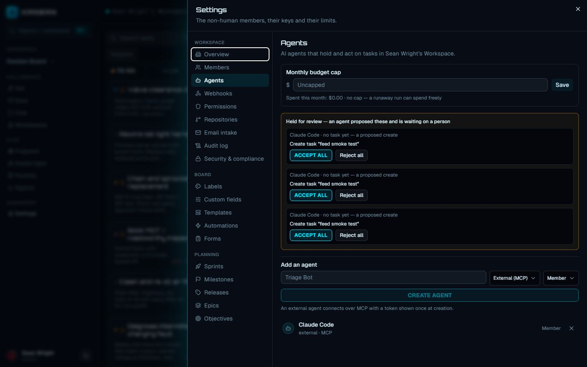
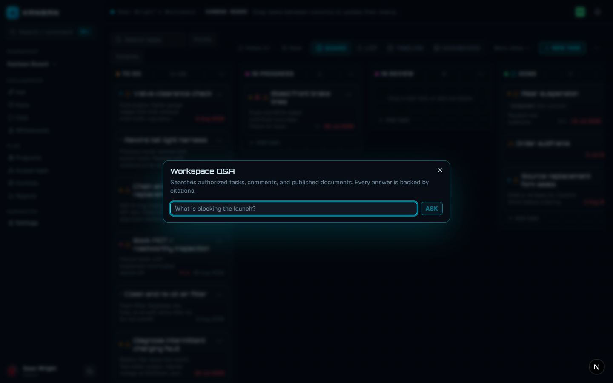

Every AI feature in the app follows one principle: **AI proposes, you decide**.
Schedules, workflow rules, extracted action items, and consequential agent
actions all arrive as reviewable proposals — nothing consequential mutates your
board until a human explicitly accepts it. Signals like risk are deterministic
and explainable: every score comes with the reasons behind it, never an
untraceable guess.

## AI writing and status updates

When a native agent works a task, it writes as it goes. Its instructions tell
it to comment its reasoning so you can follow what it did and why, and to post
one short summary comment when it finishes. Those comments appear in the task's
comment thread and activity feed under the agent's own name, marked with a bot
icon — an agent's writing is always attributable, never disguised as a human's.

That closing summary is your automated status update: assign a task to an
agent (or press re-run on a task it already holds) and the run ends with a
written account of what happened. The full action-by-action record is also
kept — see [run review](#review-a-run-the-changeset) below.

## AI task creation and decomposition

Tasks can enter the board from AI-driven paths, and each one passes through the
same creation gate a human uses:

- **From meeting notes** — the Docs dialog extracts action items from a meeting
  document and lets you promote them to tasks one at a time (see
  [meeting notes to tasks](#meeting-notes-to-tasks)).
- **From an agent** — a native agent's `create_task` and `create_subtask` tools
  are changeset-tier: when the agent decides a goal needs new work items or a
  breakdown into subtasks, those creations are *proposed* and held in the run's
  changeset for you to accept or reject. This is how a prompt-level goal
  ("work this epic") becomes a reviewed structure of subtasks rather than a
  silent flood of cards.
- **From an external agent** — a coding agent connected over the
  [HTTP API](/kanban/agents/http-api/) or [MCP server](/kanban/agents/mcp/)
  creates tasks under its own identity, subject to its workspace role, with
  every action logged to the task history.

## AI prioritization (scoring assist)

Agents carry a `score_task` tool that sets a task's value and risk on a 0–10
scale. Combined with the estimate, the board derives a priority score —
`value / (estimate × (1 + risk/10))` — and ranks by it. The formula lives in
code, not in a model: an agent supplies the judgment (value, risk), the ranking
stays deterministic and explainable. Scoring is auto-tier (it executes
immediately) but every call is recorded in the run's action trail with its
before and after state.

## Schedule proposals

Press **Schedule** in the board header to open the Proposed schedule dialog.
The planner (`proposeSchedule`) runs a deterministic critical-path pass over
the board:

- **Dependencies win** — a task starts the day after its last blocker ends.
- **One lane per assignee** — each person's tasks are sequenced so nobody is
  double-booked.
- **Capacity-aware durations** — if a member has a weekly point budget, a
  task's estimate is converted into calendar days against that budget
  ("fits 3 points into 10 points/week capacity"). Without a budget, one point
  maps to one day.

Every proposed row shows the task, its proposed start and due date, and the
reasons — "after dependency #12", "after assignee's planned work" — so no date
is unexplainable. Nothing is written when the dialog opens: you review the
list, then press **Apply reviewed schedule** to commit the dates to the board.
Close the dialog and the board is untouched.

## Risk prediction

Delivery risk is a derived signal computed from explainable board facts — no
model supplies the score:

| Signal | Contribution |
|---|---|
| Overdue (due date in the past) | +0.5 |
| Each declared blocker | +0.2 (capped at +0.35) |
| Open 14+ days | +0.2 |
| Open 7–13 days | +0.1 |

A score of 0.6+ is **high**, 0.25+ is **medium**, anything above zero is
**low**. Tasks in the done column are excluded — finished work carries no risk.

You see risk in two places:

- **On cards** — an at-risk task (overdue or blocked) shows a compact risk
  mark with a tooltip explaining why.
- **In Insights** — the "Risks — explainable delivery signals" panel lists
  every at-risk task with its level, percentage score, and the full reason
  list, sorted by severity.

## Ask: workspace Q&A

The **Ask** button (sparkles icon) in the header opens Workspace Q&A. Type a
question — "What is blocking the launch?" — and it searches your workspace's
tasks, comments, and *published* documents using PostgreSQL full-text search,
then returns a deterministic answer assembled from the top matching excerpts,
with every source cited beneath it (up to 12 citations, each showing its kind,
title, and excerpt).

Two boundaries matter here:

- **Authorization is the retrieval filter.** The query requires viewer access
  to the workspace and only searches that workspace's own content. Unpublished
  drafts are not searched.
- **Every claim is a citation.** The answer is built verbatim from the cited
  excerpts — a claim you cannot trace to a source cannot appear. This same
  contract is designed to hold if a hosted embedding model is added behind it
  later.

## AI workflow builder

The [Automations](/kanban/guide/automations/) builder includes a
describe-it-in-words box. Type a rule in plain language — "When a PR merges,
move it to Done" or "When CI fails, comment: investigate" — and `draftAutomation`
turns it into a real automation rule with a trigger, conditions, and actions.

The draft discipline:

- The rule is created **disabled**, named `Draft: …`, and sits in the builder
  for an admin to inspect, edit, and enable — generation, never silent
  activation.
- The parser is deliberately constrained: it recognizes PR-merge, CI-failure,
  task-moved, and task-created triggers with move and comment actions. A
  prompt it cannot map is refused with example phrasings rather than guessed
  at — an automation that fires on real events must never be a hallucination.

## Meeting notes to tasks

Meeting documents (Docs dialog → **Meeting**) come with an Action items
section. When the meeting is over, press **Review actions**: the extractor
reads the document and returns each unchecked Markdown checkbox
(`- [ ] Follow up with legal owner: Dana due 2026-08-01`) as a proposed action
item, with owner and due-date hints parsed out of the line. It extracts
explicit checkboxes only — it never invents work from prose.

The proposals are just a list until you act: **Promote action** creates the
task through the normal task-creation gate, under your identity, logged like
any other creation.

## Agents as teammates

Agents are first-class assignees that live beside humans. There are two kinds
— the two doors:

- **Native (Door 1)** — hosted and driven by the app. Carries a Claude model
  and an optional system prompt. Assigning it a task starts a run
  automatically. No credential to manage.
- **External (Door 2)** — an agent you run yourself (Claude Code, Cursor, a
  script) that connects over the [HTTP API](/kanban/agents/http-api/) or
  [MCP server](/kanban/agents/mcp/) with an agent key.

### Lifecycle

1. **Create** — under **Settings** → **Agents** (name, kind, workspace role;
   model and system prompt for a native agent), or from the CLI:
   `npm run create-agent -- --workspace <slug|id> --name "My Bot"`. An
   external agent's key is minted and shown **once** — only its hash is
   stored, so it can never be fetched again.
2. **Assign** — the agent appears in the assignee picker beside people, with
   the same fields (name, avatar, role) and a bot mark. Assigning a task to a
   native agent enqueues a run; an external agent watches the board itself.
3. **Claim** — the agent takes an exclusive hold (`claim_task`) before
   working, so two agents never grab the same task. The claim shows on the
   card, with the bot mark when the holder is an agent.
4. **Work** — the agent reads the task and board, then acts through a fixed
   toolset. Every mutating call passes through the approval gate below.
5. **Comment** — reasoning as it goes, one summary comment at the end.
6. **Release** — the hold is dropped when the agent stops or finishes.

An agent's role works like a human's: a viewer agent can hold a task it cannot
move, exactly as a viewer human can. Task deletion and archiving are absent
from the named MCP toolset. The direct HTTP API does expose task deletion to
member-role agent principals, so operators must treat agent-key distribution
and role assignment as the destructive-operation boundary; the approval policy
does not mediate this direct route.

### Review a run: the changeset

A native agent's consequential actions are not applied — they are collected
into the run's **changeset**, "a pull request for the board", shown in the
task panel when the run finishes (`awaiting your review`). You see everything
the run did: the auto-tier actions it already took (field edits show an Undo
button for a window) and the held proposals, which you accept **all, some, or
none** of in one pass. Twenty proposals are one review, not twenty interrupts.
A run whose every action was auto-tier simply ends `done` with nothing to
review.

### Governance: the approval gate

Every mutating tool call passes through a three-tier gate, defaulted by blast
radius. Admins can override the tier per tool, per agent, via the agent's
approval policy; an unknown mutating tool defaults to changeset — held, not
run.

| Tier | Meaning | Default tools |
|---|---|---|
| `auto` | Executes now; recorded with before/after; field edits undoable for a window | `comment_on_task`, `claim_task`, `release_task`, `set_priority`, `set_labels`, `set_due_date`, `set_estimate`, `set_type`, `score_task`, `aim_at_milestone`, `rename_task`, `flag_blocker` |
| `changeset` | Held as a proposal for human review after the run | `assign_task`, `move_task`, `create_task`, `create_subtask` |
| `block` | Never autonomous — refused with a message | none by default (destructive tools are not exposed at all) |

A held call never reaches the database, so the audit log never records a
mutation that did not happen. Every gated call — executed, proposed, or
blocked — is written to the run's action trail, and auto-tier actions link to
the activity-log entry they produced.

:::note
Spending is governed too. **Settings** → **Agents** sets a monthly dollar budget cap
for the workspace; every native run meters its token spend (including prompt
cache usage) as it goes. A run is refused before it starts if the cap is
blown, and halted mid-run the moment it crosses it.
:::

## Humans and agents in capacity planning

The **Sprints** section's capacity view counts agents beside humans: sprint work
assigned to an agent appears in the per-assignee breakdown with a bot mark, so
a plan that leans on agents says so.

The board Capacity dialog (weekly point budgets vs. committed demand) is
deliberately human-only: an agent's cost is metered in dollars against the
workspace budget cap, not in story points, so the points view stays an honest
picture of human capacity while **Settings** → **Agents** shows agent spend.

## The two doors

Everything above is the in-app experience. To connect your own agent:

- **[Agent HTTP API](/kanban/agents/http-api/)** — REST endpoints authenticated
  by agent key, for scripts and custom integrations.
- **[MCP server](/kanban/agents/mcp/)** — the same capabilities as MCP tools,
  for Claude Code, Cursor, or any MCP client.

Both doors share one identity, RBAC, and audit model — an agent is the same
teammate whichever door it walks through.
