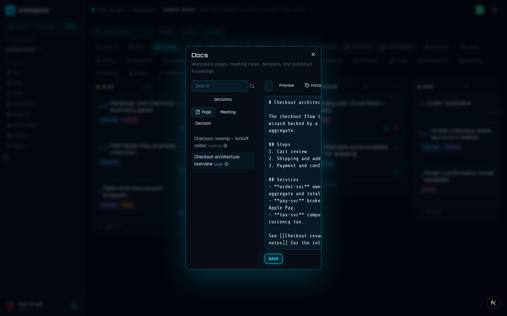
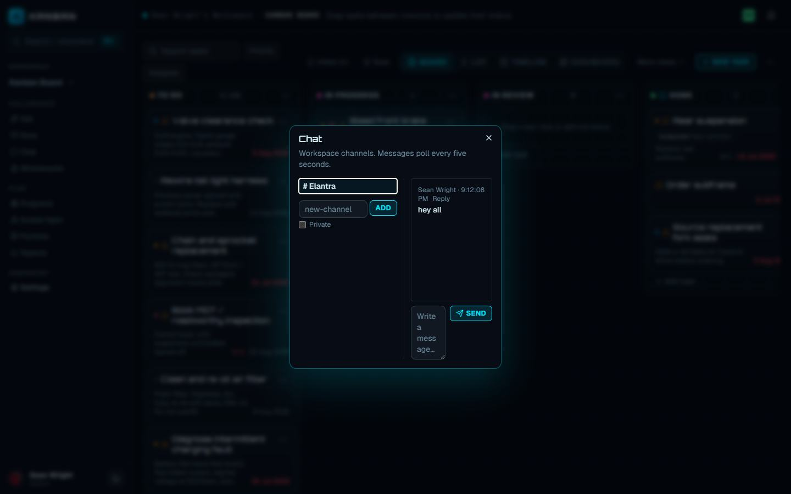

Every board carries a workspace tool cluster — `Ask`, `Docs`, `Chat`, and `Whiteboards` buttons that render in the sidebar on wide screens and fall back into the header on small ones. `Ask`, `Docs`, and `Chat` open focused dialogs. `Whiteboards` replaces the board area with a full workspace surface while keeping the app header and sidebar visible.

## Docs and wiki

The `Docs` button opens the workspace's documentation space: "Workspace pages, meeting notes, decisions, and published knowledge."

The left rail lists every document with its kind badge, filtered live by the `Search` box (title and body) and by the `Decisions` toggle, which narrows the list to decision logs. Documents form a tree — each has an optional parent and a position among its siblings — and can also be attached to a specific board, which matters for [meeting notes](#meeting-notes).

Every document has one of three kinds, each created from its own button and template:

| Kind | Button | Template |
|---|---|---|
| `page` | `Page` | Blank, titled `Untitled page` |
| `meeting` | `Meeting` | `# Attendees`, `# Agenda`, `# Notes`, `# Action items` with a starter checkbox |
| `decision` | `Decision` | `# Context`, `# Decision`, `# Rationale`, `# Status` (starting at `Proposed`) |

The editor pane is Markdown with a `Preview` / `Write` toggle; preview renders the same safe subset comments use. Bodies support **wikilinks**: write `[[Page title]]` and preview resolves it to a link to the document with that title (case-insensitive). An unresolved wikilink stays as literal `[[…]]` text.

Editing is anyone above viewer; viewers read everything but see no create, save, or delete controls. On the server, creating and updating a document requires the `member` role and deleting requires `admin` — and deletion is refused while the document is under a legal hold.

### Revision history

Every save that changes the body first snapshots the previous body as a revision. The `History` button lists revisions newest-first with a timestamp and who made the edit.

### Publishing and search

Documents carry an `isPublished` flag. Toggle it with the **Publish** button in a document's toolbar (member role and above) — it reads `Publish` for a draft and `Published` once live, and each document's row in the tree shows a globe when it is published. The same flag is settable through the API's `POST /api/workspaces/[id]/docs` and `PATCH /api/docs/[id]`. Publishing is what promotes a page from working draft to knowledge base:

- `GET /api/workspaces/[id]/docs?q=…` runs a Postgres full-text search over **published documents only**.
- [Workspace Q&A](#knowledge-base-and-workspace-qa) cites published documents alongside tasks and comments.

## Real-time co-editing

The document editor is collaborative. It binds a plain textarea to a Yjs `Y.Text`, so two people typing in the same document merge keystroke-by-keystroke instead of overwriting each other — the CRDT owns merging, and React never races a render against a collaborator's edit.

Collaboration runs through a separate WebSocket process (`realtime/server.mjs`) speaking the standard Yjs `y-websocket` protocol, because a standalone Next.js build cannot host a custom WebSocket server. It persists every update to a `doc_yjs_update` log and compacts the log into a `doc_yjs_snapshot` when the last editor disconnects, so a document's live state survives restarts.

The same process serves [whiteboards](#whiteboards) in `wb-<id>` rooms, with their own update log and snapshot. A ticket names the kind of room it opens, so a document ticket cannot open the canvas that happens to share its number.

:::note
Run `npm run realtime` beside the app. The server listens on port `1234` by default (`REALTIME_PORT` / `REALTIME_HOST` to change it), and the client connects to `NEXT_PUBLIC_REALTIME_URL`, falling back to `ws://localhost:1234`.
:::

Access is double-checked. Opening a document first calls `POST /api/docs/[id]/collaboration-ticket`, which authorizes you against the document and returns a short-lived (60-second) HMAC-signed ticket scoped to that one document. The realtime server verifies the ticket, then re-checks live membership in the database — and a `guest` connects only if the document has been [explicitly shared](#guest-access) with them.

Viewers get a read-only editor and never open a socket.

## Meeting notes

A document with kind `meeting` is a meeting note. Its template scaffolds attendees, agenda, notes, and a Markdown checklist of action items. When a meeting note is selected, two extra buttons appear for editors:

- `Review actions` extracts every **unchecked** `- [ ]` item and lists them as proposed action items. Extraction is deterministic — it parses explicit checkboxes and never invents work from prose. An `@Name` or `owner: Name` in the line becomes an owner hint, and `due YYYY-MM-DD` becomes a due-date hint.
- `Promote action` turns the first unchecked action item into a real task in the first column of the meeting's board, described as `Promoted from meeting note: <title>`. This requires the `member` role, and the meeting note must be attached to a board — a note without one is refused, because there is no implicit destination for the work.

For the AI-assisted version — a reviewable draft of extracted action items you approve before tasks are created — see [AI and agents](/kanban/guide/ai-agents/).

## Decision logs

A document with kind `decision` is a decision log. The template walks you through context, the decision itself, the rationale, and a status line that starts at `Proposed` — edit it as the decision moves to accepted or superseded. The `Decisions` toggle in the Docs sidebar filters the tree down to decision logs, so the workspace's decision history reads as one list. Decisions get everything other documents get: revisions, co-editing, publishing, and wikilinks back to the pages they affect.

## Knowledge base and Workspace Q&A

The `Ask` button (sparkles icon) opens the `Workspace Q&A` dialog: type a question (up to 500 characters) and press `Ask`.

The answer is retrieval, not generation. The server runs an authorization-filtered full-text search across three sources in your workspace — tasks, comments, and **published** documents — and stitches the top excerpts into an answer, listing every source under `Sources` with its kind, title, and excerpt. Every claim is a quoted excerpt from a citation, never an untraceable guess. Any role from `viewer` up can ask; results never cross workspace boundaries.

This deterministic layer is also the retrieval foundation the AI features build on — see [AI and agents](/kanban/guide/ai-agents/) for the assistant side.

## Chat

The `Chat` button opens native workspace chat. The left rail lists channels (`# name`); the pane shows the selected channel's messages, polling every five seconds.

- **Channels** — anyone `member` and above can create one from the `new-channel` box (`Add`). Creation from the dialog makes a public channel; the API also accepts `isPrivate: true`.
- **Private channels** — a private channel is visible only to its members (the creator is added automatically). To everyone else it is absent from the list and its messages return not-found.
- **Threads** — a message can carry a `parentId`; replies render indented under their parent. Threaded posting is currently API-only (`POST /api/channels/[id]/messages` with `parentId`) — the dialog composer sends top-level messages.
- **Formatting** — message bodies render the same safe Markdown subset as comments: React elements only, never raw HTML.

Reading a channel requires `viewer`; posting requires `member`. There are no direct messages yet — a private channel with two members is the working equivalent. Notification-generating `@mentions` live in [task comments](#comments-on-tasks), not chat.

## Whiteboards

The `Whiteboards` button opens a visual workspace scoped to the current board — a self-hosted [Excalidraw](https://excalidraw.com/) editor, no third-party service involved. Its canvas fills the board area, with whiteboard navigation in a compact rail and a close button that returns you to the unchanged board.

- **Multiple boards** — the left rail lists every whiteboard on this kanban board; editors create more with the `Board name` box and `Add`.
- **Task cards** — pick a task from the `Add task card…` select and press `Task card` to drop a card (rectangle plus `Task #id: title` label) onto the canvas, tagged with the task's id. Sketch architecture around real work items.
- **Draw together** — a canvas is shared through the same realtime service the documents use. Each shape is synced on its own, so two people drawing at once merge instead of overwriting: the line under the canvas reads **Live** when a room is holding it and everyone in it sees your strokes as you make them.
- **Autosave** — with no realtime service running, the canvas falls back to saving the whole scene automatically, debounced to half a second so a stroke persists once rather than per pixel, with a final flush when the whiteboard workspace closes. That fallback is single-writer — the last save of two people wins — which is why the status line says which mode you are in. In a live room the service saves the canvas itself when the last person leaves.
- **Roles** — viewers get Excalidraw's view mode: they can pan and read but not draw, and see no create or task-card controls. A socket is a write channel, so only editors open one; a viewer reads the saved scene.

## Comments on tasks

Each task's panel has a comment thread: top-level comments with one level of replies, `Edit` / `Delete` on your own comments, and `Resolve` / `Reopen` to track whether a thread still needs attention (a resolved comment dims and shows a `· resolved` marker).

Type `@Display Name` in a comment to mention someone. Mentions are parsed on the server against the workspace roster — an exact display-name match, recomputed on every edit — and the mentioned person gets a "mentioned you on" notification in their bell. Agents can comment too, and their Markdown renders through the same safe subset as everyone else's.

Full details, including who can resolve and delete, are on the [work items](/kanban/guide/work-items/) page.

## File sharing

Files attach to tasks in two ways:

- **Attachments** — the task panel's Attachments section uploads files (up to 25 MB each) into the app's own storage. Downloads are streamed by the server after an authorization check on every request — there is no public URL to leak.
- **Connected work** — the Integrations section links external files by URL: paste a Google Drive link (`Link Google Drive`) or a OneDrive/SharePoint link (`Link Microsoft file`). These stay remote references opened in the provider — the bytes are never copied — so the file's own sharing rules keep applying.

## Guest access

`guest` is a workspace role that ranks **below** `viewer`. Where a viewer can read the whole workspace, a guest can read nothing by default — guests are members of the workspace only so an administrator can address them, and they see exactly the objects explicitly shared with them.

An `admin` grants a share per object (`POST /api/object-shares` / `DELETE` to revoke) naming the guest, the subject — a document, board, or form — and whether the guest may edit:

- A shared **document** becomes readable (and, with edit, co-editable — the realtime server checks the share before accepting the guest's socket).
- A shared **board** is readable via the shared-board endpoint, with `canEdit` reported alongside.

A share targets an existing workspace member, so the flow is: invite the person with the `guest` role, then share the specific objects the engagement needs. Everything else in the workspace stays invisible — an unshared object answers not-found, not forbidden.

## Public sharing

Public links let people **outside the app** see something with no account at all. An `admin` mints a link (`POST /api/public-links`) for a document, board, form, or saved view, choosing:

- **Scope** — `read` for view-only pages, `submit` for intake forms.
- **Expiry** — an optional expiration timestamp; an expired link answers not-found.

Each link is an unguessable token — 32 random bytes, so the URL itself is the secret:

- `/public/docs/<token>` — a read-only rendered document.
- `/public/boards/<token>` — a read-only board: columns and top-level cards, no subtasks, served with `Cache-Control: no-store` so nothing lingers in shared caches.

:::caution
Anyone holding the URL can open it — treat a public link like the content itself. Revoking (`DELETE /api/public-links/[id]`, admin-only) deletes the token immediately; the page answers not-found on the next request.
:::

Public pages expose only the linked object, resolved fresh on every request — there is no session, no workspace navigation, and no write path on a `read`-scoped link.
