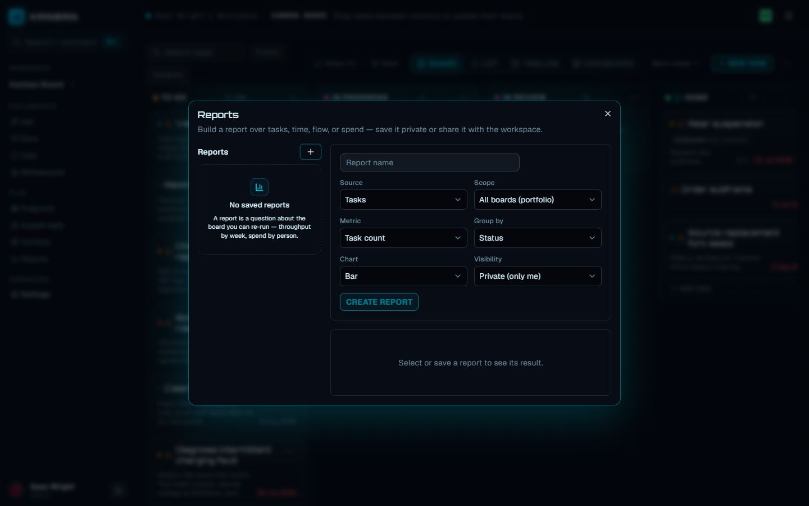

Every number in the app is derived on demand from stored facts - task history, time entries, and rates. Nothing is pre-aggregated, so reports always reflect the board as it is right now.

## Board insights

**Insights** is the board's flow-metrics dialog. Open **Board tools** (`⋯` at the end of the board toolbar) and choose **Insights**, or use the command palette (**Open Insights**). Metrics are replayed from the board's full history each time you open it.

The dialog shows, top to bottom:

- **Lead time (created -> done)** and **Cycle time (started -> done)** - one stat tile each, with the average in days, the median, and how many completed tasks the figure is based on. Cycle time starts when a task first moves out of its original column.
- **Throughput - completions per week** - a bar chart of tasks finished per week over the last eight Monday-anchored weeks.
- **Burndown** - shown when a sprint is active: committed points, remaining points per day, and a dashed ideal line from the committed total to zero over the sprint window. See [Agile workflows](/kanban/guide/agile/) for sprints.
- **Velocity - points completed per sprint** - a bar per closed sprint with a dashed average line.
- **Risks - explainable delivery signals** - see below.
- **Cumulative flow - last 30 days** - a stacked area chart of task counts per column per day, stacked in board order so the leftmost column sits at the base. Widening bands reveal where work accumulates.
- **Workload - open tasks by assignee** - a table of open task count and points per assignee, with agents marked `(agent)` and unassigned work in its own row.

:::note
Lead time, cycle time, and throughput need a done column. Without one the board has no notion of "finished" - designate it from the column menu with **Set as done column**.
:::

### Risk signals

Each open task is scored from explainable board facts only - no model guesses:

| Signal | Score |
| --- | --- |
| Overdue (past its due date) | +0.5 |
| Blocked by open tasks | +0.2 per blocker, capped at +0.35 |
| Open for 7+ days | +0.1 |
| Open for 14+ days | +0.2 (replaces the 7-day score) |

A score of 0.6 or more reads **high** risk, 0.25 or more **medium**. Each flagged task lists its reasons (for example "overdue since 2026-07-01 - blocked by 2 tasks"). Done tasks are never flagged.

## Dashboard lens

The **Dashboard** view toggle (in the board's view switcher) is a glanceable summary rather than a dialog: four stat tiles (**Tasks**, **Completed**, **Points**, **At Risk**), a per-column rollup, and an at-risk list of overdue or blocked tasks you can click to open. Everything is computed from the tasks the board already holds - the "Completed" tile shows a dash until a done column is set. See [Planning views](/kanban/guide/planning-views/) for the full tour of view modes.

## Custom reports

**Reports** is the workspace-level report builder, opened with the **Reports** button in the workspace header. It builds a report over tasks, time, flow, or spend, and saves the definition - results are computed fresh on every run, never stored.

To build one:

1. Click **Reports**, then the **+** button in the left-hand list (or select an existing report to edit it).
2. Name it, then pick a **Source**, **Scope**, **Metric**, **Group by**, **Chart**, and **Visibility**.
3. Click **Create report** (or **Save changes**). The result renders immediately below the form.

**Scope** is either a single board or **All boards (portfolio)** - the same cross-board rollup the portfolio uses.

### Sources and their metrics

Metric and grouping options are derived from the same tables the API validates against, so the form can only compose legal reports:

| Source | Metrics | Group by |
| --- | --- | --- |
| Tasks | Task count, Total estimate | No grouping, Status, Assignee, Priority, Label, Board |
| Time logged | Total time | No grouping, Member, Day, Board |
| Flow (cycle time) | Avg cycle time | No grouping, Board |
| Financial (spend) | Total spend | No grouping, Board, Member, Day |

### Charts and visibility

**Chart** is **Bar**, **Line**, or **Table**; every report also shows a grand total. **Visibility** is:

- **Private (only me)** - any workspace member can create these; only the author sees and manages them.
- **Shared (workspace)** - visible to everyone in the workspace; creating, editing, or deleting a shared report requires the workspace **admin** role. The builder shows "Shared report - admin required to edit" when you can view but not manage one.

A member cannot flip their private report to shared - re-sharing is judged at the target visibility, so it also needs admin.

Report definitions carry the same filter predicate saved views persist (text, priorities, labels, assignees), applied before grouping. The dialog currently saves reports with an empty filter; the API accepts the full predicate. See [Planning views](/kanban/guide/planning-views/) for the filter bar and saved views themselves.

## Financial reports

Financial reporting is the **Financial (spend)** source in the same builder: spend is derived as logged minutes x the board's hourly rate, rounded to cents - never stored. Group it by **Board** for a portfolio cost rollup, by **Member** for labour cost per person, or by **Day** for a burn line. When the scope is a single currency, values render with the board's currency code.

For per-board budget tracking, open **Board tools** and choose **Budget**. Everyone with viewer access sees the figures:

- **Budget**, **Spent**, and **Remaining** tiles, with Remaining shown in red when negative.
- A utilization bar (spend as a fraction of budget) with an "over budget" flag past 100%.
- Hours logged at the hourly rate, and a per-contributor breakdown of hours and cost.

Setting the numbers is admin-only: admins see a **Budget** / **Rate /h** / **Currency** editor at the bottom of the dialog. Leave Budget empty for "no budget" - spend is still costed at the rate.

## Time tracking

Time is logged per task, in the **Time** section of the task panel. Enter minutes in the **Min** field, optionally note what the time went to ("What for?"), and click **Log**. The section shows the task's running total and every entry with its duration, author, date, and note. You can delete your own entries (click **Delete**, then **Really?** to confirm); each write lands in the task's activity feed.

:::note
Time tracking is humans-only. Agents never log minutes - their spend is metered in dollars elsewhere, so timesheets and labour costs always describe people.
:::

Time entries feed the timesheet, the budget's spend figure, and the **Time logged** and **Financial** report sources.

## Timesheets

Open **Board tools** and choose **Timesheet** for the board's weekly time grid: one row per contributor, one column per day, each cell showing logged time as `Xh Ym`. A **Total** column sums each row, and an **All** footer row totals each day and the whole week.

The first open defaults to the week ending today; the previous/next week arrows step a week at a time, and closing the dialog resets back to the current week. Review is read-only - entries are corrected on the task itself.

## Estimates

Each task carries an optional **Estimate** field (points) in the task panel, shown on the card. Estimates power the points column of the Insights workload table, sprint velocity and burndown, the Dashboard's **Points** tile, and the **Total estimate** report metric. Estimating is covered with sprints in [Agile workflows](/kanban/guide/agile/).

## Exporting board data

Open **Board tools** and choose **Export CSV** or **Export JSON** to download the board's tasks. An export is a read, so any role that can see the board (viewer and up) can export it. Agents can call the same endpoint: `GET /api/board/{id}/export?format=csv|json`.

Both formats carry one row per task with these columns:

`id`, `title`, `description`, `type`, `status` (column title), `priority`, `estimate`, `assignee`, `milestone`, `epic`, `objective`, `sprint`, `value`, `risk`, `priority_score`, `start_date`, `due_date`, `labels`, `parent_task`, `created_at` - plus one column per custom field the board defines, appended after the fixed set.

Details worth knowing:

- CSV follows RFC 4180: fields with commas, quotes, or newlines are quoted, quotes are doubled, and lines end in CRLF (the ending Excel is happiest with).
- Labels are joined into one cell with a semicolon and space.
- Subtasks are included as their own rows, with `parent_task` naming their parent - the board hides them behind a count, but the file never drops rows.
- Assignee, milestone, epic, objective, and sprint names are resolved server-side, so the file needs no ID lookups - and names come from the email-free roster, so an export never carries an address the board itself would not show.

:::tip
The JSON export is the same rows as the CSV (custom fields as a `customFields` object), which makes it the easy input for BI tools or scripts without CSV parsing.
:::

## Saved filters and reports

The board's filter bar (text, priority, label, and assignee predicates) and saved views are the reporting system's query language: a saved view captures a filter plus a view mode, and report definitions reuse the identical filter shape for row selection. Build the slice once as a saved view, and the same predicate vocabulary carries into reports. See [Planning views](/kanban/guide/planning-views/) for saved views in full.