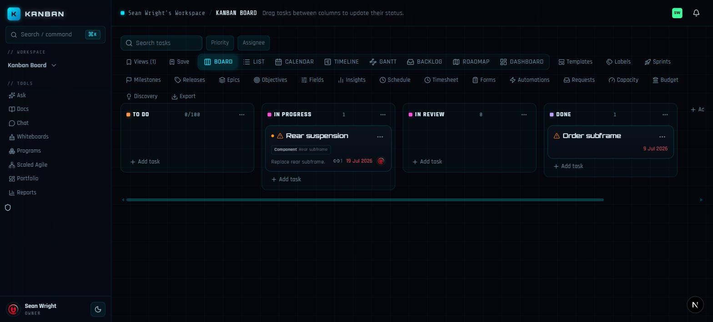

import { Card, CardGrid } from '@astrojs/starlight/components';

<CardGrid stagger>
	<Card title="Full work-management surface" icon="puzzle">
		Boards, lists, calendars, Gantt, roadmaps, dashboards. Sprints, epics,
		OKRs, SLAs, automations, docs, chat, whiteboards, forms, reports — 132 of
		140 industry benchmark criteria implemented natively.
	</Card>
	<Card title="Agents are teammates" icon="rocket">
		Two doors for AI agents: a plain HTTP API and an MCP server. Agents
		authenticate with workspace-scoped keys, obey the same RBAC as people,
		claim tasks with exclusive holds, and every action lands in the audit
		trail under their own name.
	</Card>
	<Card title="Automation engine" icon="setting">
		Trigger → condition → action rules on the board's own event stream:
		notifications, SLAs, routing, state-transition guards, scheduled rules,
		inbound/outbound webhooks, and sandboxed custom scripts.
	</Card>
	<Card title="Developer-native" icon="github">
		GitHub, GitLab, and Bitbucket apps link branches, PRs, commits, CI runs,
		and releases to tasks. Smart-commit parsing, REST + GraphQL APIs, and a
		merged PR can drive an automation rule.
	</Card>
	<Card title="Enterprise-ready" icon="approve-check">
		SSO (SAML/OIDC), SCIM provisioning, granular permissions, admin console,
		AES-256-GCM secret encryption, retention and legal hold, eDiscovery
		export, IP allowlisting — all self-hosted, your data stays yours.
	</Card>
	<Card title="One Postgres, one repo" icon="seti:db">
		Next.js + Postgres, deployed with Docker Compose. No external services
		required; blob storage and realtime collaboration ship in the box.
	</Card>
</CardGrid>
