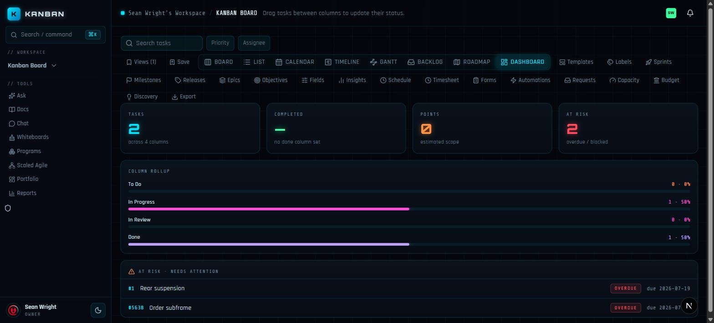
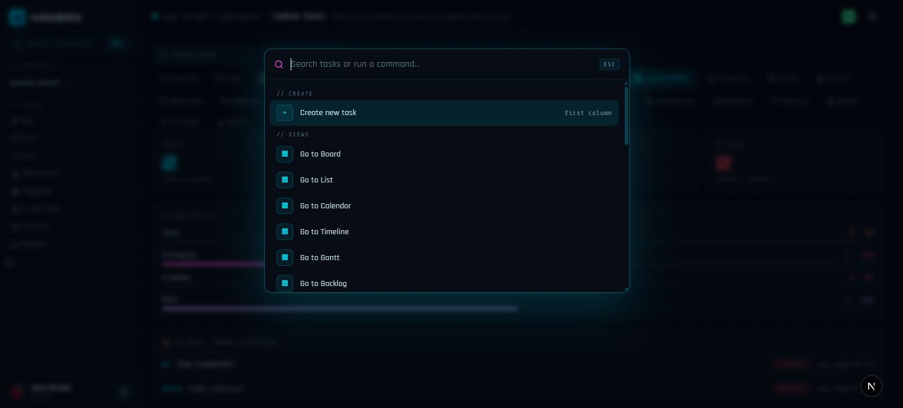
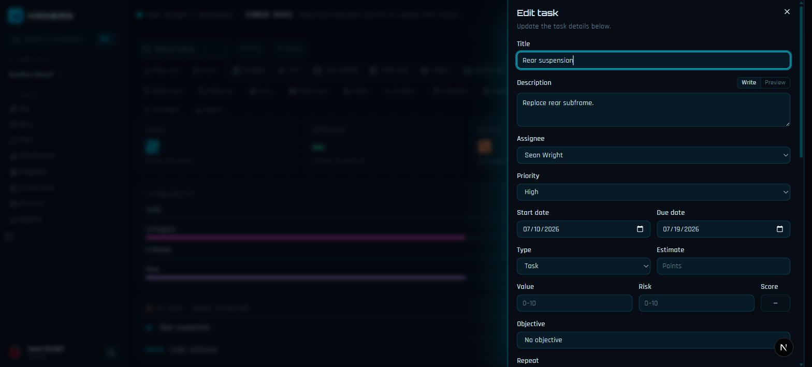

## The shell

The app is one screen with a sidebar and a board:

- **Sidebar** — brand, the workspace/board switcher, and the tool panels
  (Docs, Chat, Whiteboards, Programs, Scaled Agile, Portfolio, Reports, Admin
  console). Your identity and role sit in the footer.
- **Header** — workspace / board breadcrumb, the member avatar stack, and
  notifications.
- **Board area** — the current lens over the board's tasks.

The UI ships dark-first in a neon-grid design language; a light theme is a
toggle away in the sidebar footer.

## Eight lenses, one board

The same tasks, cut eight ways — switch with the tab row or the palette:

| Lens | What it shows |
|---|---|
| **Board** | Drag-and-drop columns with WIP limits; the only lens that drags. |
| **List** | A sortable table of every task. |
| **Calendar** | Tasks by due date. |
| **Timeline** | Start→due spans over time. |
| **Gantt** | Dependency arrows + the critical path. |
| **Backlog** | The sprint-planning queue (drag to a sprint). |
| **Roadmap** | Epic swimlanes over milestone dates. |
| **Dashboard** | Stat tiles, per-column rollups, and an at-risk list — all derived live from the board. |

Any lens + filter combination can be saved as a named view.

## Command palette

`Ctrl`/`⌘` + `K` anywhere (or the sidebar search pill):

- **Create** — new task in the first column.
- **Views** — jump between the eight lenses.
- **Panels** — open any board panel (Templates, Labels, Sprints, Milestones,
  Releases, Epics, Objectives, Fields, Insights, Schedule, Timesheet, Forms,
  Automations, Requests, Capacity, Budget, Discovery).
- **Task search** — type two or more characters to find a task by title and
  open it.

Arrow keys move, `Enter` runs, `Esc` closes.

## Tasks

A task opens as a right slide-over panel, so the board stays in sight. Beyond
title/description/assignee/priority/dates, tasks carry estimates, value/risk
scores, objectives, recurrence, labels, custom fields, subtasks, checklists,
dependencies, attachments, comments with mentions, time entries, linked
branches/PRs/commits/CI, and a full activity history.

An assignee can be a **person or an agent** — both count in capacity planning,
and an agent working a task holds an exclusive claim the card shows.

